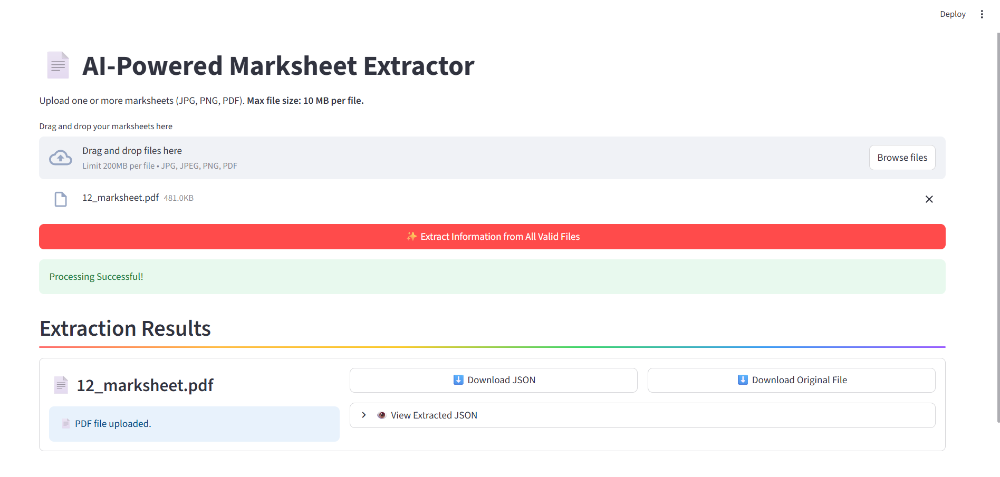

📄 AI-Powered Marksheet Extractor
=================================

An intelligent API that extracts structured data from various marksheet formats (images and PDFs) using advanced OCR and Large Language Models.

* * *



✨ Features
----------

*   Extracts candidate details, subject-wise marks, grades, and overall results.
    
*   Handles multiple marksheet formats (marks-based, grade-based, etc.).
    
*   Calculates and provides a confidence score for each extracted field.
    
*   Supports batch processing of multiple files in a single API call.
    
*   Secured with API key authentication.
    
*   Includes a user-friendly Streamlit demo page for easy interaction.
    

* * *

 Tech Stack
--------------

*   **Backend:** Python, FastAPI
    
*   **AI/ML:** Google Gemini, DocTR (OCR)
    
*   **Frontend:** Streamlit
    
*   **Libraries:** Pydantic, python-dotenv, pdf2image
    

* * *

 Local Setup & Installation
-----------------------------

#### 1\. Clone the repository:

Bash

    git clone <your-repo-link>
    cd marksheet-extractor 

#### 2\. Create a virtual environment:

Bash

    python -m venv venv
    source venv/bin/activate  # On Windows: venv\Scripts\activate 

#### 3\. Install dependencies:

Bash

    pip install -r requirements.txt 

#### 4\. Install Poppler

The application requires the Poppler library to process PDF files.

*   **Windows:**
    
    1.  Download the latest Poppler binary from [this link](https://github.com/oschwartz10612/poppler-windows/releases/).
        
    2.  Extract the zip file to a permanent location (e.g., `C:\Program Files\poppler`).
        
    3.  Add the path to the `bin` directory (e.g., `C:\Program Files\poppler\bin`) to your system's **PATH environment variable**.
        
*   **macOS (using Homebrew):**
    
    Bash
    
        brew install poppler 
*   **Linux (Debian/Ubuntu):**
    
    Bash
    
        sudo apt-get install -y poppler-utils 

#### 5\. Set up Environment Variables:

Create a `.env` file in the root directory and add the following secrets.
```
GEMINI_API_KEY="your-google-gemini-api-key"
API_KEY="your-chosen-secret-api-key" 
```
* * *

⚙️ Usage
--------

1.  **Run the Backend API:**
    
    Bash
    
        uvicorn main:app --reload 
    
    The API will be available at `http://127.0.0.1:8000/docs`.
    
2.  **Run the Frontend Demo:**
    
    Bash
    
        streamlit run frontend.py 

* * *

🌐 CURL Example
---------------

You can test the batch endpoint using curl. This example sends two files for processing.

Bash

    curl -X 'POST' \
      'http://127.0.0.1:8000/extract/' \
      -H 'accept: application/json' \
      -H 'X-API-Key: your-chosen-secret-api-key' \
      -F 'files=@/path/to/your/marksheet1.pdf' \
      -F 'files=@/path/to/your/marksheet2.png'